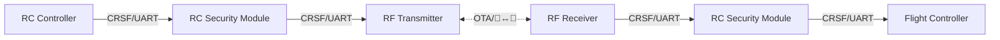
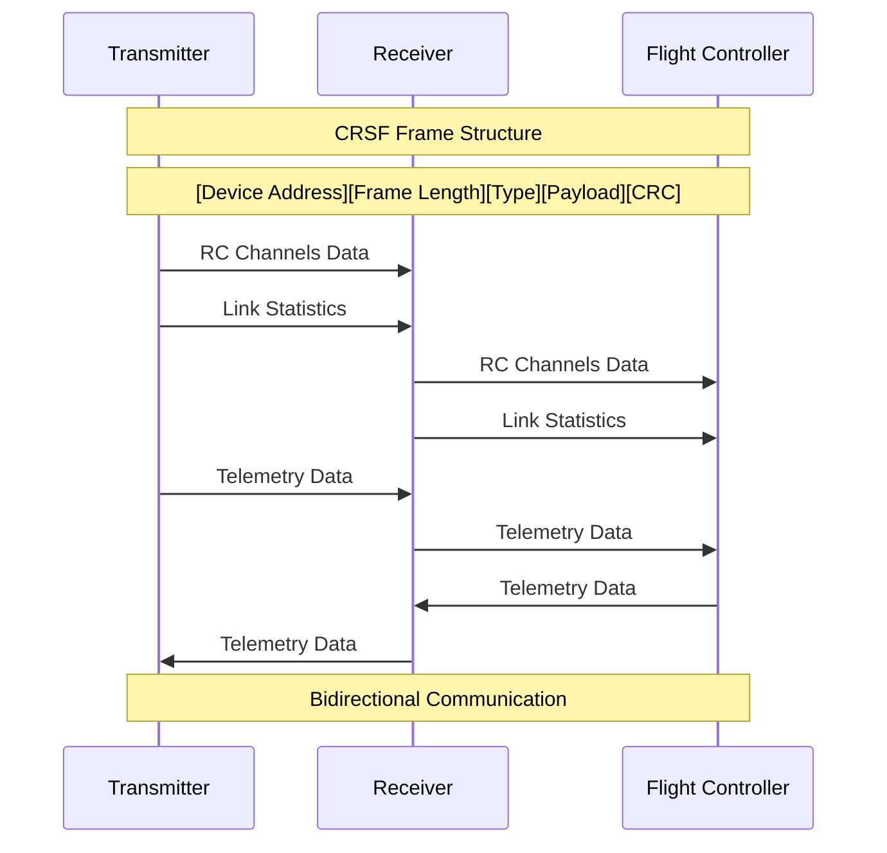

# RC Security Module

STM32F479IIHx

## Connections



### Debug Connector Pin Out

| Pin Number | Description |
|------------|-------------|
| 1          | VCC         |
| 2          | SWDIO       |
| 3          | SWCLK       |
| 4          | GND         |
| 5          | NRST        |
| 6          | SWO         |

### Uarts Connector Pin Out

| Pin Number | Description |
|------------|-------------|
| 1          | VIN 5~12V   |
| 2          | UART1 TX    |
| 3          | UART1 RX    |
| 4          | UART4 TX    |
| 5          | UART4 RX    |
| 6          | UART5 TX    |
| 7          | UART5 RX    |
| 8          | GND         |

### UART Pinmap

STM32F479IIHx UART Pinmap

```
// PA10     ------> USART1_RX
// PA9      ------> USART1_TX

// PC11     ------> UART4_RX
// PC10     ------> UART4_TX

// PC2      ------> UART5_RX
// PC12     ------> UART5_RX
```

### CRSF protocol

https://github.com/crsf-wg/crsf/wiki



이 다이어그램은 CRSF 프로토콜의 기본 구조와 데이터 흐름을 보여줍니다:
- 프레임 구조: Device Address, Frame Length, Type, Payload, CRC
- 송신기(TX)에서 수신기(RX)로 RC 채널 데이터와 링크 통계 전송
- 수신기(RX)에서 비행 컨트롤러(FC)로 RC 채널 데이터와 링크 통계 전달
- 비행 컨트롤러(FC)에서 수신기(RX)로 텔레메트리 데이터 전송
- 수신기(RX)에서 송신기(TX)로 텔레메트리 데이터 전달
- 양방향 통신 지원

# 펌웨어 빌드 방법 

## 1. 개발 환경 설치 

1. 개발에 필요한 라이브러리와 컴파일러 설치 

```sh
make setup
```

2. 도커 이미지 빌드

```sh
make build-docker-image
```

## 2. 개발 환경 컨테이너 실행

도커 컨테이너 실행. (빌드 하기전에 실행 해두어야 함.)

```sh
make run-docker-container
```

## 3. 펌웨어 빌드

TX 펌웨어 빌드
```sh
make build-tx
```

RX 펌웨어 빌드
```sh
make build-rx
```

## 4. 펌웨어 업로드

펌웨어 빌드를 하면 다음 위치에 펌웨어 파일이 생긴다.

```
.pio/build/TX/firmware.elf
.pio/build/RX/firmware.elf
```

STM MCU 프로그래머stlink v3을 이용해서 펌웨어를 타겟 보드에 올린다.
