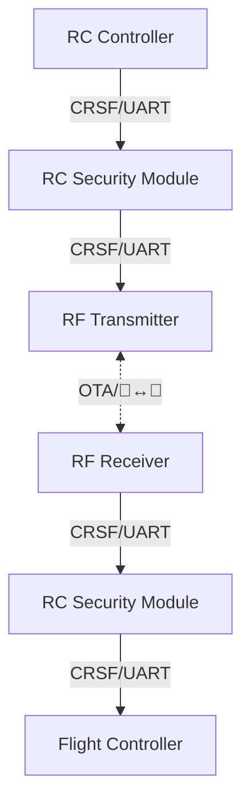
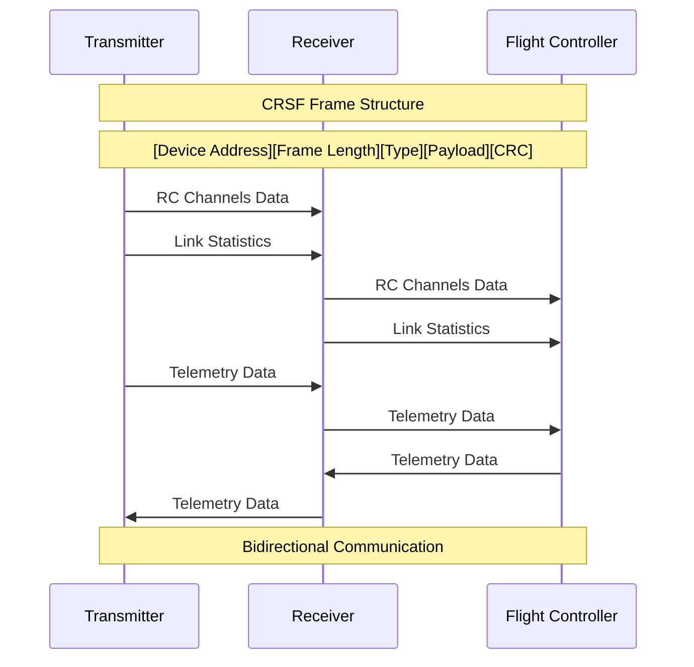

# RC Security Module

STM32F479IIHx

## Connections



### Debug Connector Pin Out

| Pin Number | Description |
|------------|-------------|
| 1          | VCC         |
| 2          | SWDIO       |
| 3          | SWCLK       |
| 4          | GND         |
| 5          | NRST        |
| 6          | SWO         |

### Uarts Connector Pin Out

| Pin Number | Description |
|------------|-------------|
| 1          | VIN 5~12V   |
| 2          | UART1 TX    |
| 3          | UART1 RX    |
| 4          | UART4 TX    |
| 5          | UART4 RX    |
| 6          | UART5 TX    |
| 7          | UART5 RX    |
| 8          | GND         |

### UART Pinmap

STM32F479IIHx UART Pinmap

```
// PA10     ------> USART1_RX
// PA9      ------> USART1_TX

// PC11     ------> UART4_RX
// PC10     ------> UART4_TX

// PC2      ------> UART5_RX
// PC12     ------> UART5_RX
```

### CRSF protocol

https://github.com/crsf-wg/crsf/wiki



이 다이어그램은 CRSF 프로토콜의 기본 구조와 데이터 흐름을 보여줍니다:
- 프레임 구조: Device Address, Frame Length, Type, Payload, CRC
- 송신기(TX)에서 수신기(RX)로 RC 채널 데이터와 링크 통계 전송
- 수신기(RX)에서 비행 컨트롤러(FC)로 RC 채널 데이터와 링크 통계 전달
- 비행 컨트롤러(FC)에서 수신기(RX)로 텔레메트리 데이터 전송
- 수신기(RX)에서 송신기(TX)로 텔레메트리 데이터 전달
- 양방향 통신 지원

## Setup

PlatformIO 설치

```
curl -fsSL -o get-platformio.py https://raw.githubusercontent.com/platformio/platformio-core-installer/master/get-platformio.py
python3 get-platformio.py
```


