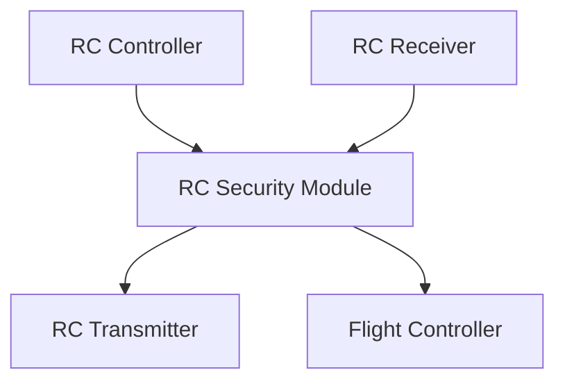

# RC Security Module

STM32F469IIHx

## Connection

### Debug Connector Pin Out

| Pin Number | Description |
|------------|-------------|
| 1          | VCC         |
| 2          | SWDIO       |
| 3          | SWCLK       |
| 4          | GND         |
| 5          | NRST        |
| 6          | SWO         |

### Uarts Connector Pin Out

| Pin Number | Description |
|------------|-------------|
| 1          | VIN 5~12V   |
| 2          | UART1 TX    |
| 3          | UART1 RX    |
| 4          | UART4 TX    |
| 5          | UART4 RX    |
| 6          | UART5 TX    |
| 7          | UART5 RX    |
| 8          | GND         |
